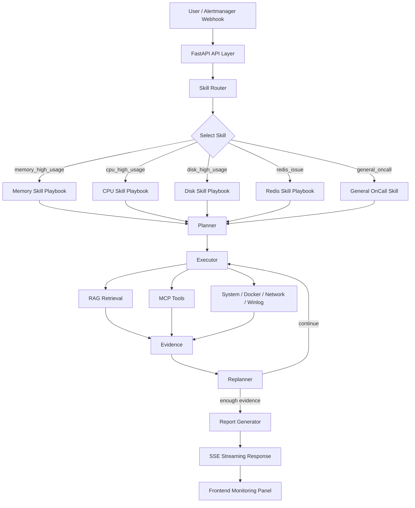

# Multi-Agent AIOps Platform

面向 OnCall / SRE 场景的多智能体智能运维诊断平台。

项目基于 `FastAPI`、`LangGraph`、`RAG`、`Milvus`、`MCP` 和 DeepSeek / DashScope 兼容大模型构建。系统采用 **先选择 Skill，再规划诊断步骤，再调用工具执行，最后复盘生成报告** 的流程，可根据告警或故障描述自动选择合适的诊断策略，调用知识库和实时工具服务，输出结构化诊断报告。


---


### 1. AgentHarness 控制面

新增文件 `app/runtime/agent_harness.py`，作为 Agent 运行时的控制面。原本散落在 `agents/`、`services/rag/`、`skills/` 里的 prompt、模型、运行策略和统计代码统一到 `AgentHarness`，主要管以下几件事：

- **全局 prompt 管理**：Skill Router、Planner、Executor、Replanner、Report、RAG Chat、Query Rewrite、Memory Compact 等所有阶段的 prompt 模板都从 Harness 取，调 prompt 不用再到处翻文件。
- **模型分层**：每个阶段一个独立模型入口，Router / Planner 可以走快模型、Report / RAG Chat 走强模型，模型通过 `.env` 切换。
- **Replanner 前置保护**：进 Replanner LLM 之前先判断是否已到最大步数、是否在重复同一步、能否直接快进剩余 plan，满足条件就跳过 LLM 调用。
- **Reroute 配额**：限制 Skill 切换次数，并要求积累一定步骤后才允许换 Skill，避免 Agent 在多个 Skill 之间反复横跳。
- **降级 fallback**：知识库或联网搜索失败时返回稳定的降级上下文和前端可见的降级事件，业务代码不再自己处理异常。
- **统计与预算**：把 token、耗时、工具调用次数等指标收敛成统一的 stats 事件，并支持 token / 时间预算的 warning 与 exceeded 告警。

V2 没有改 Agent 流程拓扑，只是把 Skill Router、Planner、Executor、Replanner、Report、RAG Chat 各阶段的 prompt、模型和策略来源换成 Harness。

### 2. 联网搜索切换到 open-webSearch

`app/core/web_search.py` 新增 `open_websearch` provider，调用本地 [open-webSearch](https://github.com/Aas-ee/open-webSearch) daemon 完成联网搜索，不再依赖 Tavily API Key。`.env` 里只需配置：

```env
WEB_SEARCH_PROVIDER=open_websearch
OPEN_WEBSEARCH_BASE_URL=http://127.0.0.1:3210
```

老配置 `WEB_SEARCH_PROVIDER=tavily` 会兼容映射到新 provider，不需要手动迁移。

### 3. open-webSearch 启动脚本

- `docker-compose.yml` 新增 `open-websearch` 服务，可由 Docker Compose 统一启停并带健康检查。
- `run.ps1` 一键启动时优先走 Docker Compose 拉起 open-webSearch；Docker 不可用时回退到本地 `npm run serve`。
- `run.ps1 -Stop` 同时停止 Compose 服务和监听端口，避免误杀 Docker 端口代理进程。


## 核心设计

传统的 Agent 诊断系统如果直接把完整 SOP、完整工具列表和用户问题一起交给 Planner，容易出现 prompt 过长、工具选择噪声大、诊断步骤不可控等问题。

本项目采用 **Skill-first** 的多智能体流程：

```text
用户告警 / 故障描述
        |
        v
Skill Router
先判断故障类型，选择最匹配的 Skill
        |
        v
Skill Playbook
加载该故障类型对应的 SOP、工具白名单和诊断策略
        |
        v
Planner
基于选中的 Skill 生成诊断计划
        |
        v
Executor
只调用该 Skill 允许的只读 MCP 工具 / RAG 检索 / 系统查询
        |
        v
Replanner
根据工具结果判断继续执行、调整计划或收敛
        |
        v
Report
生成结构化 Markdown 诊断报告
```

核心思路是：

> **先选 Skill，再规划；先收敛上下文，再调用工具。**

这样可以减少无关 prompt，降低工具误选概率，并让诊断链路更稳定、更容易观测。

## 功能特性

- **Skill-first 多智能体诊断**：先通过 `Skill Router` 识别 CPU、内存、磁盘、Redis、本机诊断、通用 OnCall 等故障类型，再加载对应 Skill Playbook。
- **Plan-Execute-Replan 流程**：基于 `Planner -> Executor -> Replanner -> Report` 的诊断闭环，支持动态调整诊断步骤。
- **Skill 工具白名单**：每个 Skill 只暴露相关 MCP 工具，减少无关工具进入上下文，降低误调用风险。
- **RAG 知识库**：使用 DashScope Embedding + Milvus，支持 OnCall SOP 和 Prometheus 告警语料检索。
- **实时 MCP 工具服务**：接入系统信息、网络诊断、Windows 日志、Docker 等只读工具服务，支持实时采集诊断证据。
- **RAG Chat + MCP**：RAG 聊天不仅能查知识库，也可以按需调用 MCP 工具获取当前系统状态。
- **并行工具调用**：对互不依赖的只读工具进行并发执行，缩短多工具诊断等待时间。
- **真实 Token 监控**：支持 DeepSeek / DashScope 流式 usage 回传，前端展示 input / output / total tokens。
- **SSE 流式输出**：前端实时展示 Skill 选择、诊断计划、工具调用、token、耗时和最终报告。
- **告警 Webhook**：支持 Alertmanager Webhook 触发后台诊断。

## 架构概览



## 数据流

```text
1. 输入阶段
   用户输入告警 / 故障描述，或 Alertmanager Webhook 推送告警。

2. Skill 选择阶段
   Skill Router 根据语义选择最合适的 Skill，例如 memory_high_usage。

3. 上下文收敛阶段
   系统只加载该 Skill 对应的 Playbook、SOP 摘要和工具白名单。

4. 计划生成阶段
   Planner 基于选中的 Skill 生成诊断步骤，避免全量 SOP 注入。

5. 工具执行阶段
   Executor 调用 RAG 检索和 MCP 只读工具，独立工具可并行执行。

6. 复盘阶段
   Replanner 判断证据是否足够，决定继续执行、调整计划或生成报告。

7. 报告阶段
   Report Generator 输出 Markdown 诊断报告，前端通过 SSE 实时展示全过程。
```


## 数据来源

项目保留三类 OnCall 知识库语料：

| 路径 | 说明 |
|---|---|
| `docs/sop/` | 项目内置 Redis / MySQL / 通用告警 SOP |
| `data/kb_corpus/awesome-prometheus-alerts/` | 从开源项目 `samber/awesome-prometheus-alerts` 整理的 Prometheus 告警语料 |
| 小林 OnCall Agent 项目 | 参考其中的 OnCall Agent 场景设计和诊断思路 |


## 技术栈

| 类型 | 技术 |
|---|---|
| Web 服务 | FastAPI + Uvicorn |
| Agent 编排 | LangGraph + LangChain |
| LLM | DashScope / Qwen，兼容 DeepSeek OpenAI-style API |
| Embedding | DashScope `text-embedding-v4` |
| 向量数据库 | Milvus |
| 会话记忆 | Redis，可选 |
| 工具协议 | MCP / FastMCP |
| 本机监控 | psutil |
| 前端 | HTML + TailwindCSS + Vanilla JS |
| 运行环境 | Python 3.11+ / Docker / Windows PowerShell |

## 快速开始

### 1. 克隆项目

```powershell
git clone <your-repo-url>
cd multi_agent_github
```

### 2. 创建 Python 环境

```powershell
python -m venv .venv
.\.venv\Scripts\Activate.ps1
pip install -r requirements.txt
```

### 3. 配置环境变量

```powershell
copy .env.example .env
notepad .env
```

至少需要配置：

```env
DASHSCOPE_API_KEY=your-dashscope-api-key
KB_ADMIN_TOKEN=change-this-admin-token
```

默认联网搜索使用 `mock` 模式，不需要外部搜索 API。

如需 Tavily 搜索：

```env
WEB_SEARCH_PROVIDER=tavily
TAVILY_API_KEY=your-tavily-api-key
```

### 4. 启动 Milvus 和 Redis

```powershell
docker compose up -d
```

Milvus 用于向量检索，Redis 用于可选的 RAG Chat 会话记忆。

### 5. 导入知识库

先检查切分结果：

```powershell
python scripts\ingest_kb_corpus.py --dry-run
```

确认无误后写入 Milvus：

```powershell
python scripts\ingest_kb_corpus.py --reset
```

如需重新从上游开源项目生成语料：

```powershell
powershell -ExecutionPolicy Bypass -File scripts\fetch_kb_corpus.ps1
python scripts\convert_prometheus_alerts.py
```

### 6. 启动应用

```powershell
powershell -NoProfile -ExecutionPolicy Bypass -File .\run.ps1
```

默认会启动：

```text
FastAPI       http://localhost:9900
system MCP    http://localhost:8005/mcp
winlog MCP    http://localhost:8008/mcp
network MCP   http://localhost:8009/mcp
docker MCP    http://localhost:8011/mcp
```

停止服务：

```powershell
powershell -NoProfile -ExecutionPolicy Bypass -File .\run.ps1 -Stop
```

## 访问地址

| 页面 | 地址 |
|---|---|
| Web UI | http://localhost:9900 |
| Swagger | http://localhost:9900/docs |
| ReDoc | http://localhost:9900/redoc |
| 健康检查 | http://localhost:9900/api/v1/health |
| 就绪检查 | http://localhost:9900/api/v1/health/ready |
| Attu Milvus UI | http://localhost:8000 |

## 使用示例

### 本机诊断

```text
我电脑很卡，帮我看下是不是 CPU 或内存太高
```

系统会选择本机诊断 Skill，并通过 MCP 工具读取 CPU、内存、磁盘和进程信息。

### Redis 告警诊断

```text
Redis 实例 redis-master-01 内存使用率 98%，客户端连接被强制断开
```

系统会结合 Redis SOP、Prometheus 告警知识库和工具返回的信息生成诊断报告。

### Alertmanager Webhook 模拟

```powershell
python scripts\mock_alert.py --scenario redis
python scripts\mock_alert.py --list-history
```

## API 概览

| 功能 | 方法 | 路径 |
|---|---|---|
| AIOps 诊断，SSE | POST | `/api/v1/aiops/diagnose` |
| Alertmanager Webhook | POST | `/api/v1/webhook/alertmanager` |
| RAG Chat | POST | `/api/v1/chat/stream` |
| Skill 列表 | GET | `/api/v1/skills` |
| 上传文档 | POST | `/api/v1/documents/upload` |
| 文档列表 | GET | `/api/v1/documents` |
| 删除文档 | DELETE | `/api/v1/documents/{source}` |
| 健康检查 | GET | `/api/v1/health` |
| 就绪检查 | GET | `/api/v1/health/ready` |

知识库上传和删除需要请求头：

```http
X-KB-Admin-Token: your-admin-token
```

## 项目结构

```text
multi_agent_github/
├── app/                    # FastAPI / Agent / RAG / Skill 核心代码
├── mcp_servers/            # MCP 工具服务
├── frontend/               # 前端页面
├── docs/sop/               # 内置 OnCall SOP
├── data/kb_corpus/         # RAG 开源语料
├── scripts/                # 知识库和告警模拟脚本
├── docker-compose.yml      # Milvus + etcd + MinIO + Attu + Redis
├── requirements.txt
├── .env.example
├── .gitignore
└── run.ps1                 # Windows 一键启动脚本
```

